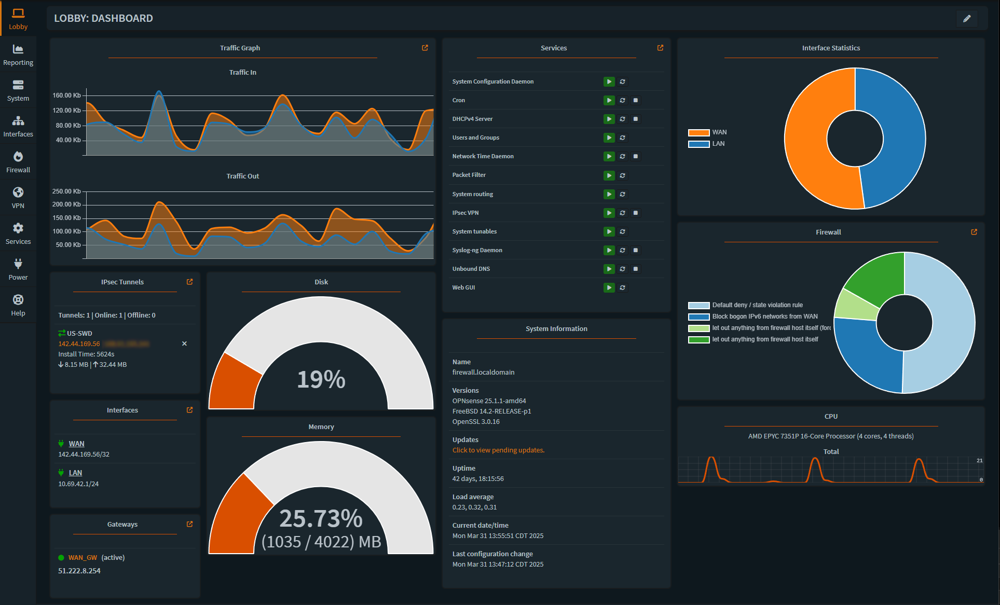
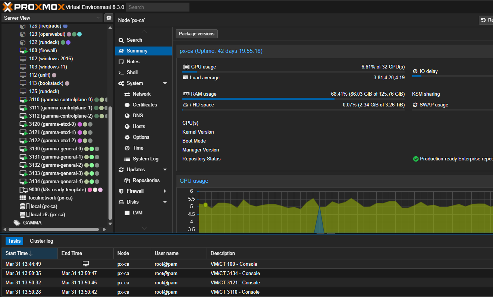

# Proxmox on OVH

  

  
  
  

  

    

      
    

    

      
    

  

  Utilize OVH dedicated server as powerful self-contained virtualization environment with secure private networking

## About

This documentation guides you through creating a virtualization environment on your OVH dedicated server, featuring:

- Latest Proxmox VE 8.3 hypervisor
- A secure OPNsense virtual firewall
- Private networking capabilities within the datacenter

It's something of a familiar homelab experience, but with datacenter hardware and connectivity

  

    

      
      
<strong>Secure Networking</strong>

    

    

      
      
<strong>Powerful Virtualization</strong>

    

  

## Documentation

Visit the [documentation site](https://tnware.github.io/proxmox-on-ovh/) to get started.

## Contributing

This is a knowledge-base project focused on documenting the deployment process of Proxmox VE specifically on OVH infrastructure. Contributions are welcome for:

- Expanding deployment scenarios
- Clarifying existing instructions
- Adding missing information
- Correcting technical inaccuracies

## License

This documentation is licensed under the [Creative Commons Attribution 4.0 International License](LICENSE).

---

  Made with ❤️ by <a href="https://tylermade.net">Tyler Woods</a>

