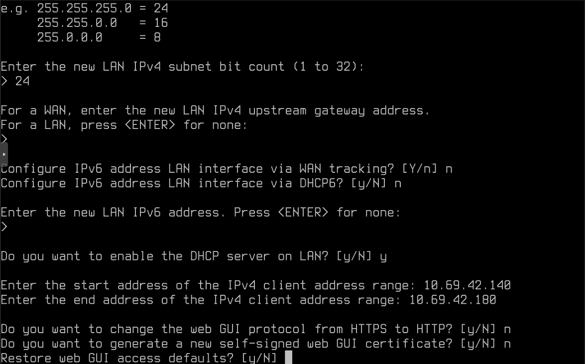
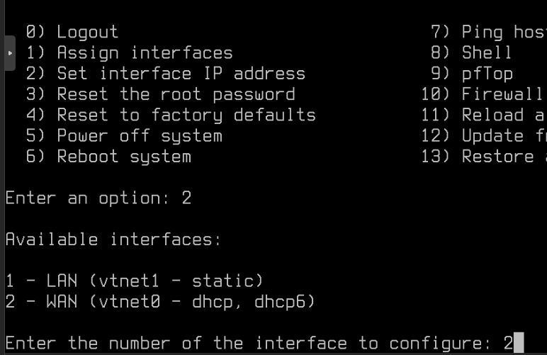
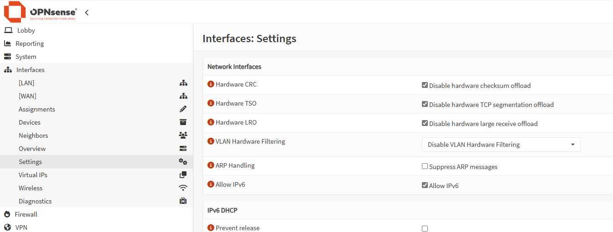

# Initial Configuration

After successfully installing OPNSense, you'll need to perform some initial configuration to get your firewall operational. This guide walks you through:
1. Configuring network interfaces
2. Setting up IP addresses
3. Accessing the Web UI
4. Completing initial setup

## Network Interface Configuration

### Step 1: Assign Interfaces

1. Log in to the console with your credentials:


2. You'll see the main configuration menu:


3. Select option `1` to assign interfaces

4. When prompted about LAGGs or VLANs, choose `no`:


5. You'll see a list of available interfaces. Note that `vtnet0` will be your WAN interface - you can verify this by matching the MAC address with your OVH IP Virtual MAC:


6. Assign the WAN interface by entering `vtnet0`:


7. Assign the LAN interface by entering `vtnet1`:


8. Press Enter without typing anything to skip the optional interface:


9. Confirm the configuration by entering `y`:


### Step 2: Configure IP Addresses

From the main menu, select option `2` to set interface IP addresses:


#### Configure LAN Interface

1. You'll see a list of available interfaces:


2. Select the LAN interface and configure its IP address:


3. Enter your desired LAN IP configuration:


4. Complete the LAN configuration:



5. Verify the LAN configuration is complete:


#### Configure WAN Interface

1. Select the WAN interface:



2. For the WAN gateway, use your OVH server's gateway address:


3. Test your network connection to verify everything is working:


## Web UI Access

::: warning
Initial Web UI access isn't possible directly from WAN as there are no firewall rules configured yet, and nothing exists on the LAN segment.
:::

### Option 1: SSH Port Forwarding (Recommended)

Use SSH port forwarding to access the Web UI:

```shell
ssh -L 8080:10.69.42.1:80 -L 8443:10.69.42.1:443 -N -f user@remote-server
```

::: tip Configuration
Replace:
- `10.69.42.1` with your firewall's IP address
- `user@remote-server` with your Proxmox host credentials (typically `root@your-proxmox-host-ip`)
:::

This creates local port forwards:
- Port 8080 → Firewall HTTP (80)
- Port 8443 → Firewall HTTPS (443)


### Option 2: LAN VM Access
Alternatively, you can:
1. Create a new VM with GUI
2. Attach it to your LAN interface
3. Access the WebUI through this VM

### Initial Web UI Setup

1. Access the Web UI at https://localhost:8443:


2. Log in with:
   - Username: `root`
   - Password: The one you set during installation

3. Complete the Getting Started wizard:


4. Configure basic system settings:
   - Hostname
   - Domain
   - DNS servers
   - Other general preferences


5. Review the configuration summary:


### Final Configuration Check

#### Hardware Offloading

::: tip
These settings should be disabled by default when using virtio. If not, disable them manually:
:::



## Completion

Your firewall should now have a working baseline configuration. You can access the dashboard to monitor your system:


::: tip Next Steps
From here, you can:
- Configure firewall rules
- Set up VLANs
- Add additional security features
- Configure VPN access
- And more...
:::
