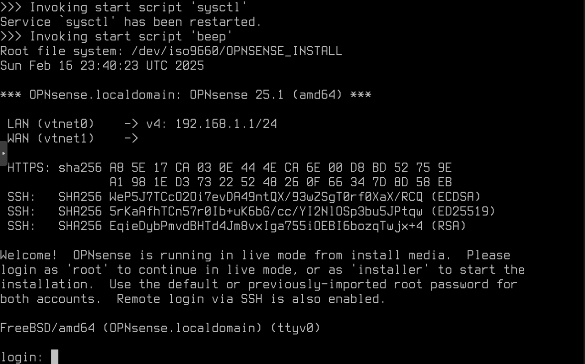
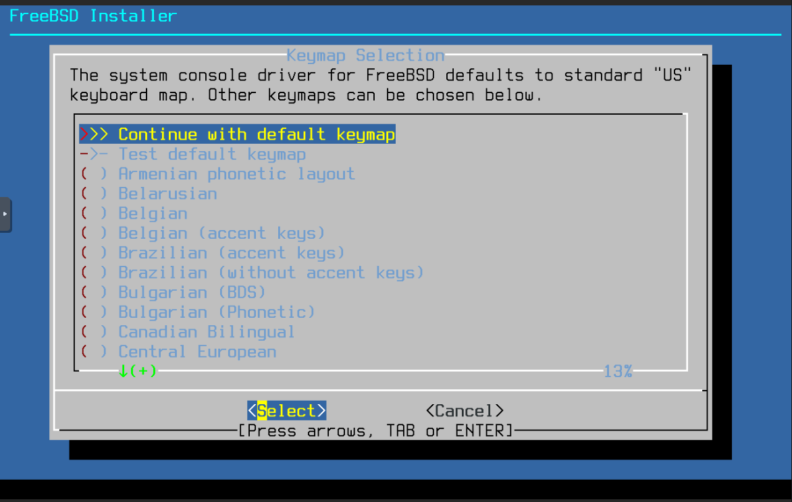
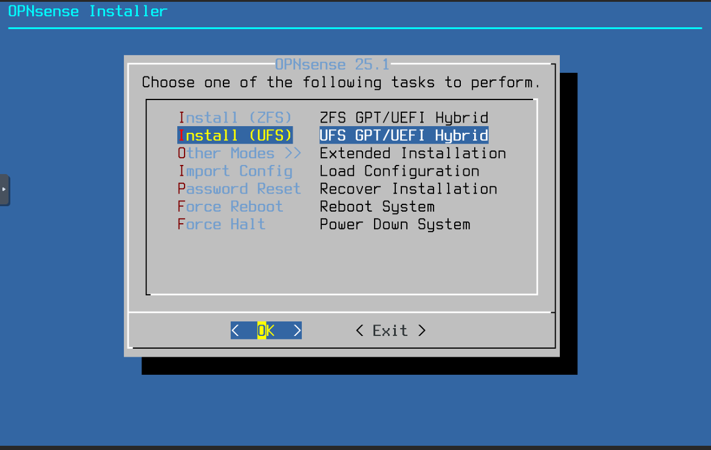
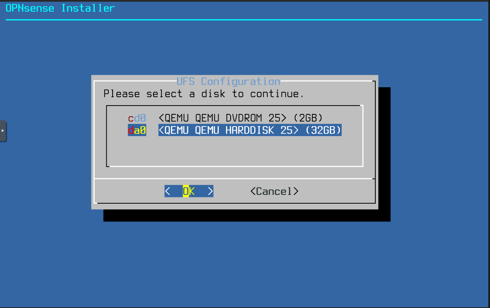
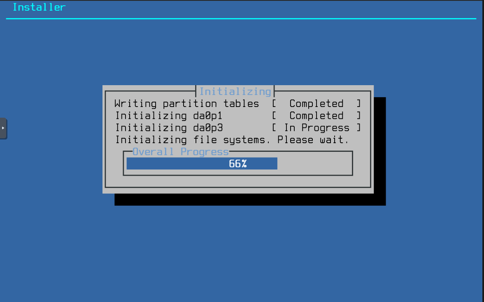
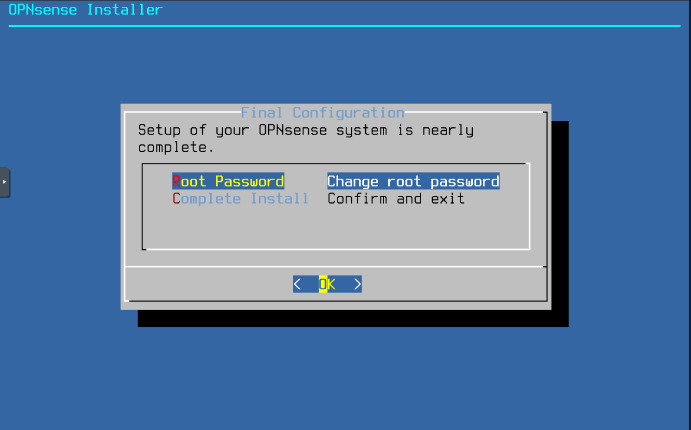
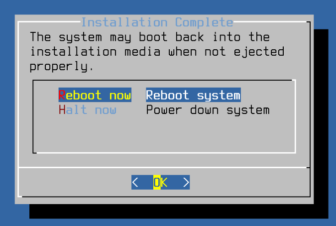
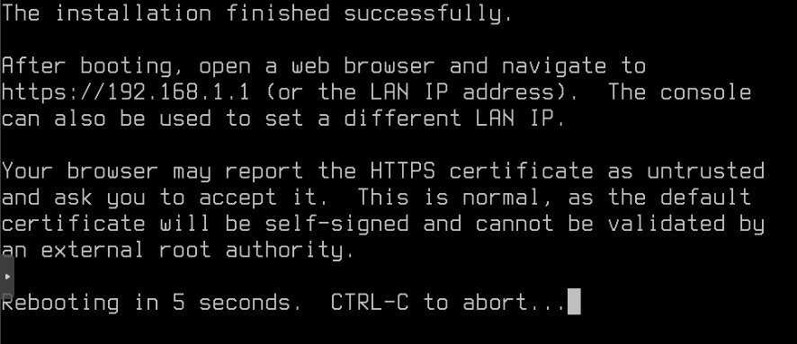

# OPNSense Installation

## Installation Steps

### Step 1: Access the Installer

When your VM boots from the ISO, you'll see the login prompt:

Log in with the default credentials:
- Username: `installer`
- Password: `opnsense`

### Step 2: Select System Settings

You'll be presented with the FreeBSD keymap selection:

::: tip
The default keymap is usually fine for most installations. Press Enter to continue if you're using a standard US keyboard.
:::

### Step 3: Choose Filesystem

::: warning Important Note
Your filesystem choice should complement your Proxmox storage configuration:
- If your Proxmox datastore uses ZFS → Consider using UFS for OPNSense
- If your Proxmox uses another filesystem → ZFS is a good default choice for OPNSense
:::

Select your preferred filesystem option:

### Step 4: Select Installation Disk

Choose the virtual disk you created during VM setup:

### Step 5: Installation Process

The system will now install OPNSense to your virtual disk. This process typically takes a few minutes:

### Step 6: Set Root Password

::: warning Security Note
Choose a strong password! This will be your primary administrative access credential.
:::

When prompted, set your root password:

### Step 7: Complete Installation

1. Click "Complete Install" when all steps are finished:

2. Choose "Reboot now" to start your new firewall:

3. The system will initiate the reboot sequence:

::: tip Next Steps
After the system reboots:
1. The firewall will start with default settings
2. Proceed to the [Initial Configuration](config.md) guide to set up your network interfaces
3. Configure your WAN and LAN settings
:::
