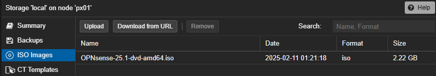
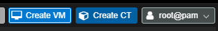
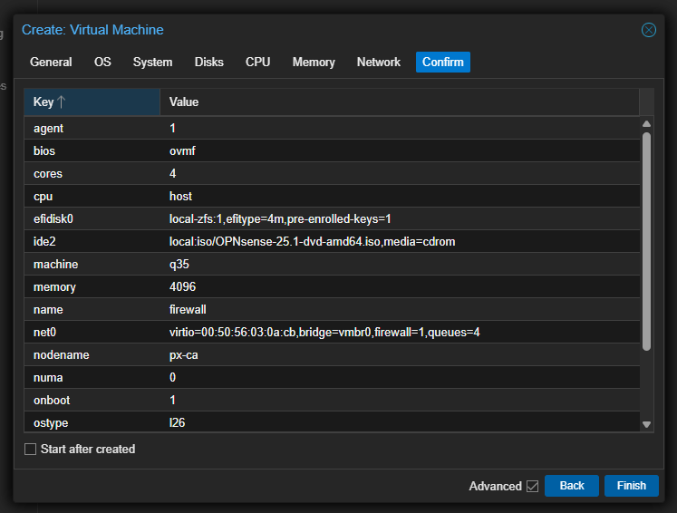

# Firewall VM Setup

## Overview

This guide walks you through setting up a virtual firewall in Proxmox VE. While we'll use OPNSense in this tutorial, you can adapt these instructions for other firewall solutions such as:
- pfSense
- Sophos
- Fortinet
- Other software firewall distributions

::: tip Compatibility
This guide is tested with OPNSense, but the VM configuration steps are generally applicable to other firewall solutions with minimal adjustments.
:::

## Prerequisites
- Proxmox VE installed and accessible
- OVH dedicated server with additional IP address
- Basic understanding of networking concepts

## Step 1: Download OPNSense ISO

### Option A: Direct Download to Proxmox

1. Navigate to your node's ISO Images section in Proxmox VE:

2. Visit the [OPNSense download page](https://opnsense.org/download/):

3. Copy the URL for the AMD64 DVD image and use "Download from URL" in Proxmox:

::: info Compression
Proxmox automatically handles the bzip compression of the ISO image - no additional steps required.
:::

4. Wait for the download to complete:

5. Verify the download was successful:

6. The ISO will now appear in your ISO Images list:

### Option B: Manual Upload
Alternatively, you can download the ISO to your local machine and upload it through the Proxmox web interface.

## Step 2: Create Virtual Machine

Click "Create VM" in the Proxmox web interface to begin the configuration wizard:

### Configuration Steps

#### 1. General Settings
- Name: Choose a descriptive name for your firewall VM
- ✓ Start at boot: Enable for automatic startup

#### 2. OS Configuration

- Attach ISO image
- OS Type: Linux
- Version: Linux kernel 6.x

#### 3. System Configuration
::: warning Important
These settings are crucial for proper UEFI boot functionality.
:::

Required settings:
- Machine: `q35`
- BIOS: `OMVF (UEFI)`
- ✓ Add EFI Disk
- EFI Storage: Select your primary storage volume

#### 4. Storage Configuration
::: tip Disk Size
Choose between 8GB-32GB depending on your needs. Most simple deployments work fine with 8GB.
:::

#### 5. CPU Settings
::: tip important
Always select `host` as CPU type to ensure optimal performance and feature availability.
:::

#### 6. Memory Configuration
- Default: 4GB RAM
- Adjust based on your specific requirements and workload

#### 7. Network Configuration

###### Obtaining Virtual MAC from OVH

1. Access OVH Manager and select your additional IP:

2. Add a virtual MAC:
   - Type: vmware
   - Name: Choose descriptive identifier

3. Wait for confirmation:

4. View the virtual MAC details:

5. Copy the MAC address for use in Proxmox:

##### WAN Interface Setup

Apply the Virtual MAC to WAN interface in Proxmox:

> Set multiqueue to 4 or 8 for better performance (depends on your core count)

::: warning
Disable "Start after creation" and add LAN interface first
:::

##### LAN Interface Setup
1. Select VM in Proxmox
2. Navigate to Hardware
3. Click "Add" → "Network Device":

4. Configure as LAN bridge and set appropriate multiqueue value:

## Step 3: Initial Boot Configuration

### UEFI Configuration
::: warning Required Step
Secure Boot must be disabled for the OPNSense ISO to boot properly.
:::

1. Start VM and press F2 repeatedly to enter BIOS:

2. Navigate through BIOS:
   - Select "Device Manager":

   

   - Choose "Secure Boot Configuration":

   

   - Disable "Attempt Secure Boot":

   

3. Save and Exit (F10)

### Boot Process
After configuring UEFI, the system will boot to the OPNSense installer:

Wait for the boot process to complete:

::: tip Next Steps
Continue to the next section for OPNSense installation and initial configuration.
:::