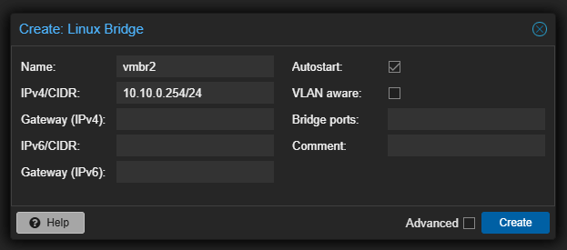
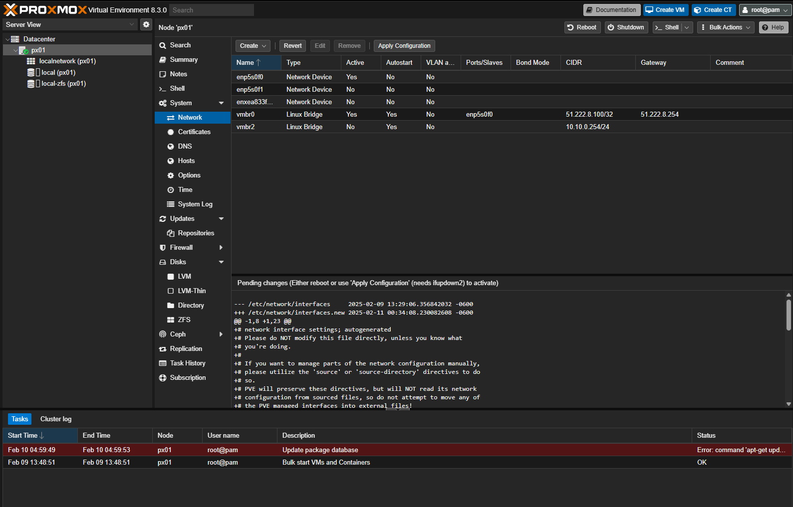

# Network Configuration

::: tip Overview
Before creating the firewall VM, we need to configure the network interfaces properly. This guide will walk you through setting up a separate network bridge for your LAN traffic.
:::

## Network Architecture

### Management Network (`vmbr0`)
::: warning Do Not Modify
The `vmbr0` interface is your default management network bridge, configured during installation. This interface should not be modified as it provides:
- Management access to Proxmox web interface
- WAN connectivity for your environment
- Default route to the internet
:::

## Creating the LAN Bridge

Since `vmbr0` handles WAN traffic, we need a separate bridge for LAN connectivity. This bridge will:
- Connect your firewall's LAN interface
- Provide network access for your virtual machines
- Create an isolated internal network

### Step 1: Initialize Bridge Creation

Click the "Create" button in the network interface section:

### Step 2: Configure Bridge Settings

::: info Bridge Configuration
1. Name: We use `vmbr2` in this guide (you can choose a different name if needed)
2. IPv4/CIDR: Set your desired LAN subnet IP address
   - This will be the Proxmox host's IP on the LAN network
   - Choose an IP that won't conflict with your firewall's LAN IP
3. Leave other settings at their defaults
:::

::: warning Important
Do not configure a gateway on this bridge. Your management network (`vmbr0`) must remain the default route to maintain web interface access.
:::

### Step 3: Apply Configuration

After creating the bridge, you must apply the changes:

1. Review the pending changes carefully
2. Click "Apply Configuration"

A confirmation dialog will appear:

## Network Bridge Usage

Your new bridge will be used for:
- OPNsense firewall LAN interface
- Virtual machine network connectivity
- Internal network communication

::: tip Next Steps
Once your network bridges are configured, you can proceed with creating and configuring your firewall VM.
:::